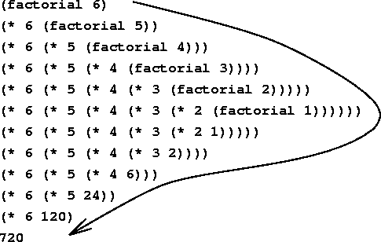

Data Structures
===============

> In computer science, a data structure is a particular way of
> organizing data in a computer so that it can be used efficiently.
> -- <cite>[Wikipedia][data_structure]</cite>

__Common Data Structures__

* Arrays
* Linked Lists
* Trees

and [more][list_of_structures], including

* Hashes

A couple of those look familiar from JavaScript and Ruby. `Arrays` and
`Hashes` are present in both languages. (In JavaScript, hashes are
called Objects). Most of your programming needs can be solved using
one of those popular structures. However, to call yourself a good
Computer Scientist you should be knowledable about a few others.

__For the most part, in your day-to-day programming, stick to the data
structures provided by your language. Don't start your first day on
some job by implementing your own linked list.__

Array
-----

You probably have a good understanding of Arrays from using them in
your day-to-day programming. They are one of the simplest and most
common data structures.

```Ruby
foods = ["kale", "broccoli", "carrots"]
foods[0] # accesses the first element (i.e., "kale")
foods[1] # accesses the second element (i.e., "broccoli")
```

### Efficiency ###

Remember the quote at the top of the page.  Not only do we want to
organize data, but we want to do it _efficiently_. Let's think about
how good or bad Arrays might be for:

* retrieving an element
    * from the beginning
    * from the middle
    * from the end
* changing an element
* removing an element
* adding an element

To do this, we may want to pause and think about how Arrays are
stored in memory. What _is_ an Array, really?

-------------------------------------------------------------------------

#### Memory ####

Your computer's memory can be thought of as a place to store
stuff. Maybe we can think of them as mailboxes. Depending on how much
memory you have, you might have X mailboxes, each with their own
address.

An Array requests access to mailboxes that are at sequential
addresses.  If I want to have an Array with 10 elements in it, I
reserve 10 mailboxes that are all right next to each other.

This is nice because it's very fast to find the _nth_ element in an
Array. You just take the starting address and move over _n_ spots.

This is bad because if you want to add an element to the array, you
need to acquire an additional mailbox, but one that is next to your
existing mailboxes might not be available. In that case you'll need to
vacate your previous 10 mailboxes and find 11 new sequential addresses
and copy your whole array into the new space.

_This is an oversimplification but it is close enough to illustrate
the tradeoffs being made with a theoretical Array. In practice, Arrays
in JavaScript or Ruby will be smarter than this and do a better job of
managing memory._

-------------------------------------------------------------------------

Linked List
-----------

A [__Linked List__][wiki_list] (or __Singly Linked List__) is another
way of organizing a list of elements.

Instead of requesting _n_ contiguous memory locations, you just create
_n_ nodes (or vertices) and link them yourself.  Each node can be
stored anywhere in memory, and you also store where to find the next
element in the list in each node.

There is also a version called a __Doubly Linked List__ that has links
going in both directions. So, instead of each node having a only a
`next` property, they also have a `previous` property.

### Efficiency ###

We already thought about the performance characteristics of the
following for Arrays.  How do they compare for Linked Lists?

* retrieving an element
    * from the beginning
    * from the middle
    * from the end
* changing an element
* removing an element
* adding an element

### Exercise ###

__Implement a Linked List__

1. Need to create a representation of a Node (or Vertex).
2. Write a method `add_to_tail` that appends a new value to the end.
3. Write a method `length` that returns the length of a list.
4. Overide the `to_s` method to nicely print the list.
5. Bonus: Write a function `remove` to remove a node from the list.

Tree
----

In a way, a [Tree][wiki_trees] is like a more generalized version of a
Linked List where each Node can have more than one child.

* Tree nodes have a parent-child relationship.
* Trees cannot contain cycles (i.e., branches can't intertwine)
* There is a starting node called a `root node`.
* A `leaf node` is one that has no children.

### Traversal ###

Searching a Tree is more complicated than searching a linear data
structure such as an Array or Linked List.

The two main approaches are:

* [Depth-first search][wiki_dfs], and
* [Breadth-first search][wiki_bfs]

DFS is the easiest to implement is the one you should tackle first in
your programming careers.

### Recursion ###


[http://en.wikipedia.org/wiki/Recursion](http://en.wikipedia.org/wiki/Recursion)

A function can call itself. The process of a function calling itself
is called recursion.

Some problems lend themselves to recursive solutions. These are
generally computer science-y questions that interviews love to ask.

#### Famous Recursive Problems ####

1. Factorial
2. Fibonacci sequence
3. Tree/Graph traversal



Resources
---------

* [Data Structure on Wikipedia][data_structure]
* [Array on Wikipedia][wiki_array]
* [Linked Lists on Wikipedia][wiki_list]
* [Trees on Wikibooks][wiki_trees]
* [64-bit Computing][wiki_64_bit]

[data_structure]: http://en.wikipedia.org/wiki/Data_structure
[list_of_structures]: http://en.wikipedia.org/wiki/List_of_data_structures
[wiki_array]: http://en.wikipedia.org/wiki/Array_data_structure
[wiki_list]: http://en.wikipedia.org/wiki/Linked_list
[wiki_trees]: http://en.wikibooks.org/wiki/Data_Structures/Trees
[wiki_64_bit]: http://en.wikipedia.org/wiki/64-bit_computing
[wiki_dfs]: http://en.wikipedia.org/wiki/Depth-first_search
[wiki_bfs]: http://en.wikipedia.org/wiki/Breadth-first_search
