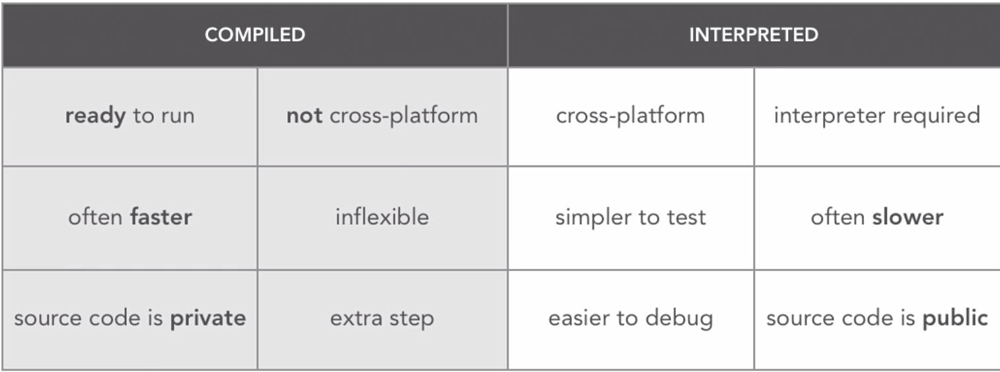
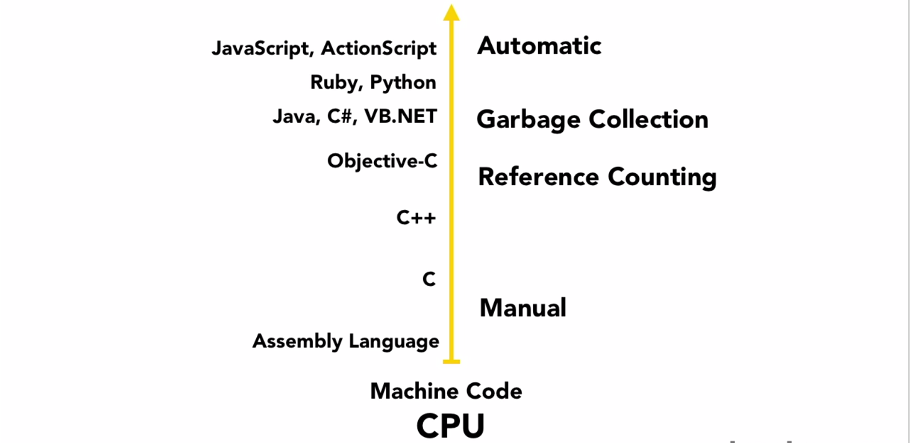

# Data structures and algorithms + CS essential concepts

### What is the goal of this monstrous readme?

- Learn the concepts behind data structures and algorithms
- Learn about big O and see some examples of algorithms and big O
- Get to a point where you can understand the data structure or algorithm and start thinking how to implement them in your language of choice
- Prepare you for interview questions relating to data structures, algorithmic efficiency and optimization
- Get you excited and interested about a really cool part of computer science! And if not....understand just why companies ask questions about this stuff.
- Understand more about how computers work and what goes on behind the scenes, especially with memory

Before we start examining data structures and algorithms, we need to understand a fundamental concept of just how we measure the efficiency of these data structures and algorithms. It would be a shame if we knew what the algorithms and data structures did, but had no concept of their performance and efficiency. 

# Algorithmic Complexity: Big O

## Asymptotic Notation

Often in software engineering, we need to choose between algorithms and data structures which are suited to different tasks.  We need to analyze our own tasks, and the data we will be using, and make informed decisions about what tools to use.  Sometimes one tool is better in every way than another, but more often we have to sacrifice memory use for computation speed, or sacrifice speed of deletions to increase speed of insertions, and so on.

So What does it mean for an algorithm to be efficient? We can't measure in terms of seconds, because hardware and software are different across all machines. One program may run slower than another because of different software or because one machine is older than other - it's like comparing apples and oranges.

So how do we compare 2 algorithms regardless of hardware and software? We measure the asymptotic complexity of a program and a notation called big O. You can see the mathematical proof [here](http://en.wikipedia.org/wiki/Big_O_notation).

What this basically means is that big O measures how fast a program's runtime grows asymptotically - as the size of the inputs increase towards infinity, how does the runtime of your program grow?

Imagine counting the letters of a string and going one by one - This algorithm would run at a linear time, for each letter n you count n times, this is also known as O(n). The time to traverse a string is proportional to the number of characters.

Say O(n) is not fast enough? What if you already stored the length and then tried to find it again? You could run 1 calculation to find the length. This program would run equally fast on a 2 character string or a 1000 character string. Accessing a variable is an asymptotically constant time operation or O(1). The runtime does not change as the size of the inputs grow.

### Why do we care?

First, it is important that the algorithms used in our applications will behave well as the amount of data our application is operating on increases.  For instance, in the absence of indexing, a database feature , the ActiveRecord code `User.where(name: "Bob")` will take `O(n)` time.  This means that if the number of users in our database doubles, it will take twice as long to find Bob.  With indexing, this will take `O(log(n))` time, meaning that the amount of time used to find Bob will double if the number of users in our database is __squared__.  This is the difference between the app collapsing into a slow and unresponsive grave when the number of users gets to thousands and the app continuing calmly to a hundred thousand or a million users.

Second, you will get these sorts of questions in interviews.

### Common Algorithmic Decisions:
* To Index or not to Index? (tree vs list)
* Should this be a hash or an array?
* Should some data be cached?
* What should we optimize?
* How should we write our SQL/ActiveRecord queries?

### A visualization of Big O

### What this looks like numerically

|   Big O	| Operations for 10 "elements"  	| Operations for 100 "elements"  	|
|---	|---	|---	|
|  O(1) 	|  1 	| 1  	|
|  O(log n)	| 3 | 	7 	|
|   O(n)	| 10 |	100 |
| O(n log n) |	30 |	700 |
| O(n^2)	|100	|10000|
| O(2^n)	|1024	|2^100 (1.2676506e+30)|
| O(n!)	|3628800	|100! (9.332622e+157)	|

### Some Complexity Classes:
* O(1) - Constant time
   * Get the first value of a list
   * Random sample from a list
   
* O(log n) - Divide and Conquer searches
   * Typical of algorithms that divide the input, then look at one of the sections
   * Searching sorted data

* O(n) - Examples:
   * Sum an array
   * Find the max of an unsorted array
   * Traversal of a list (a linked list or an array) with n elements;

* O(n log n) - Divide and pick a section for every piece of input
   * Sorting with quicksort, merge sort, or another  reasonably fast sort.

* O(n^2) - Examples:
	* Finding duplicates in an unsorted list of n elements 	(implemented with two nested loops).
   * Insertion Sort
   * Selection Sort
   * Bubble Sort
   
* O(2^n) - One new piece of data doubles the work is 2^n.
  * Naive Fibonacci

* O(n!) - List all combinations of a set, every possible subset.  Impossibly slow and hardly ever needed.
  * Naive traveling salesman

## Data Structures

### What is a data structure?

A data structure is a way to store and organize data in a computer, so that it can be used efficiently. The key word here is "efficiently". At the end of the day, we are only interested in data structures that are efficient (we will discuss how we measure efficiency later). 

With the definition out of the way, let's think about a data structure we have used since the beginning of our coding journey. How about an Array? An array is a very simple data structure, but what does it do well? What does it not do well? Start here [http://stackoverflow.com/questions/8423493/what-is-the-performance-of-objects-arrays-in-javascript-specifically-for-googl](http://stackoverflow.com/questions/8423493/what-is-the-performance-of-objects-arrays-in-javascript-specifically-for-googl).

### How should you decide which DS to use? 

Some questions you have to ask and decisions you have to make are:

- What needs to be stored?
- What are the cost of operations?
- What is the potential memory usage?
- What is the ease of implementation (not always the best question...)?

## Some common data structures 

Once again, the most important takeaway you can get from this document is an understand of just __what__ these data structures are. This is called ADT or Abstract Data Structure. When learning about a data structure, the more important thing to remember is that you want to strive to gain an understanding of just __WHAT__ it is before you even think about how to implement one. The descriptions of the following data structures will focus mostly on the definition, application and value. The implementation will be left up to you! Let's start with one of the simplest data structures - linked lists

### Linked Lists

A linked list is a data structure consisting of a group of nodes which together represent a sequence. Under the simplest form, each node is composed of a data and a reference (in other words, a link) to the next node in the sequence

#### Singly Linked List

n a singly linked list each node in the list stores the contents of the node and a pointer or reference to the next node in the list.

#### Doubly Linked List

A doubly-linked list is a linked data structure that consists of a set of sequentially linked records called nodes. Each node contains two fields, called links, that are references to the previous and to the next node in the sequence of nodes.

### Stacks

Stack - both insertion and removal happen from same end we call this a LIFO (last-in-first-out) structure

You can think of a stack simply as some items stacked on top of each other just like these cups!

### Where do we see stacks in the real world?

- How about the call stack? Remember what that is? [http://en.wikipedia.org/wiki/Call_stack](http://en.wikipedia.org/wiki/Call_stack)
- We use stacks to help in the implementation of more complex data structures and algorithms
- A stack is an extremely useful and efficient data structure for solving algorithms like figuring out a palindrome.
- Typical application areas include compilers, operating systems, handling of program memory (nested function calls)

### Queues

Queue - insertion must happen from rear/tail end of queue and removal must happen from front/head. We call this a FIFO (first-in-first-out) structure

Queue - list or collection with the restriction that insertion ca be performed at one end and deletion can be performed at the other front

Queue operations - These are all O(1)

insertion - enqueue/push/insert
deletion -  dequeue/pop/remove/delete
front/peek - find the head element (just return the element at front)
isEmpty - check if empty
IsFull - if there is a limited size

Or a real life example of a queue

### Where do we use queues?

- Batch processing: For operations where various entities are stored and held to be processed later, the queue performs the function of a buffer.
- Typical application areas include print job scheduling, operating systems (process scheduling).

And remember, the regular Array structure in Javascript is a Stack (first in, last out) and can also be used as a Queue (first in, first out) depending on the calls you make.

### Trees

So far the data structures we have seen are linear and/or sequential data structures that have a logical start and end. These include arrays, linked lists, queues, and stacks. Trees are  used to show hierarchical data (and organizational tree, a family tree. When you think about trees, visualize them as upside down with the root at top and going upside down. 

In a tree, a collection of entities called nodes are linked together to simulate a hierarchy. It is a non linear data structure and the top most node in the tree is called the root. Nodes can contain any type of data and may contain a link or reference to other nodes which can be called its children

Some tree vocabulary:

- Root - node at the top of the tree
- Parent - node above a node
- Child - nodes below a node 
- Grandparent - parent of parent
- Grandchild - child of child
- Sibling - children of same parent
- Leaf - node that does not have a child
- Internal - node that has a child
- Cousin/Uncle - you get the hint….. 
- Ancestor/Descendent - same kind of idea….
- Height - Number of edges in longest path from X to a leaf 
- Depth - length of the path from root to node X or number of edges in path from root to node X

Some tree facts: 

- Height of a tree = longest path of root to leaf
- Link - connection from a node to another node
- In a tree with N nodes, there will always be N-1 edges. 

### So where do we see trees in the real world?

Everywhere! Including:

- The file system on your disk is hierarchical data
- Organizing data for quick search insertion deletion, (BST is O(log n))
- Storing dictionary for spellchecking - Trie
- You can see some more [here](http://stackoverflow.com/questions/577659/real-world-examples-of-tree-structures)

### Binary Tree

A tree in which each node can have at most 2 children is called a binary tree. This tree gives us a nice structure for very fast search (binary search).

### Trie

Trees can also have nodes with text in them. In computer science, a trie, also called digital tree and sometimes radix tree or prefix tree (as they can be searched by prefixes), is an ordered tree data structure that is used to store strings. Unlike a binary search tree, no node in the tree stores the key associated with that node; instead, its position in the tree defines the key with which it is associated. All the descendants of a node have a common prefix of the string associated with that node, and the root is associated with the empty string

An example trie: 

Tries are exceptionally powerful and used in dictionary lookups, such as one found on a mobile telephone or for autocompletion and spell-checking.

### Other types of trees

#### B Tree

B-tree is a tree data structure that keeps data sorted and allows searches, sequential access, insertions, and deletions in logarithmic time. The B-tree is a generalization of a binary search tree in that a node can have more than two children. Unlike self-balancing binary search trees, the B-tree is optimized for systems that read and write large blocks of data. It is commonly used in databases and filesystems.

####  AVL Tree 

AVL (or height-balanced) binary search tree is any node-based binary search tree that automatically keeps its height (maximal number of levels below the root) small in the face of arbitrary item insertions and deletions

## Graphs

Also a non-linear data structure, a hierarchical structure! 

A graph is a collection of objects we call nodes or vertices connect to each other through a set of edges. In a tree there are rules dictating edges, in a graph we have none! In a tree, all nodes must be accessible from the root. So in short, a tree is just a type of graph.

In a graph there are no rules. It has a set of nodes and edges. So if you think about it some more, a tree is a special kind of graph!

##### If you want to get more into the math....

Graph = A graph G is an ordered pair of a set V or vertices and a set of E edges G = (V , E). V is the first object and E is the second 

(V, E) is not equal to (E, V) if E is not equal to V

{V, E} is an unordered pair

Nodes can be named V1….Vn

V = {V1, V2…..Vn}

##### moving on...

There are lots of different types of graphs, but here are a few examples.

- Undirected Graph

- Directed Graph

If you're interested in learning more about graphs, check out [this](https://www.youtube.com/watch?v=gXgEDyodOJU&list=PL2_aWCzGMAwI3W_JlcBbtYTwiQSsOTa6P&index=38) video

### Where do we see graphs in the real world?

A social network is an undirected graph -> The Facebook graph API!

* Let's think some more about that? How do you suggest friends? Suggest friends of friends who are not connected (nodes that are not linked).

How about some more examples?

- Interlinked Web Pages - A directed graph! A webpage is a URL, if the page contains a link to another, it has 

- Web Crawling - browse pages to collect + store data. Web crawling = Graph Traversal (act of visiting all nodes in a graph).  

-  Graphs are the fundamental data structure for technologies like GPS/Maps how do you pick the best route from one city to another? 

Weighted vs. Unweighted Graphs
Some connections are more weighted 
roads between cities (are of different lengths)
label edges with weights 
 
Unweighted - weighted where weight is the same (all 1)

Some more examples of weighted vs unweighted and directed vs undirected graphs:

- Intercity Network - Weighted, Undirected graph
- Social Network - Unweighted, Undirected graph
- World Wide Web - Unweighted, Directed graph
- Intracity - Weighted, Directed graph

# Algorithms

### What is an algorithm?

A well defined, step by step computational procedure for solving a problem 

Algorithms are:

- Deterministic - they have a goal
	- They terminate as well 
- They take input
- They produce output

## Some common sorting algorithms 

Below you will see three common sorting algorithms and some links to see them in action. One of the best ways to learn these algorithms is to try to implement them yourself. Use sticky notes, a pen and paper, cups, colored blocks or whatever you find best and try to recreate these sorting scenarios. Not only will this help you tremendously in your understanding of the algorithm, but it is __essential__ to have a fundamental knowledge before trying to implement them.

### Bubble Sort

For each element in the list, look at the element and the one to the right, if the left > right, swap them. Keep swapping until we are at the end of the array. Then move onto the next element in the array and repeat this. Bubble sort can be easily implemented using multiple loops (at least two) or recursion.

For bubble sort, The worst case is if we have backwards list (then it takes n passthroughs - 1)

We know for sure that after 1 pass the right most element is sorted correctly, and after 2 passes the right 2 elements are sorted correctly

How can we make bubble sort even smarter? We can always count to see the number of swaps and if there are none we know it's sorted.

Bubble sort is NOT an efficient algorithm, it's worst case performance is O(n^2), because you have to make n iterations through a list checking all n elements each pass so n * n = n^2. This runtime means that as the number of elements sorted increase, the runtime increase quadratically. But efficiency isn't a major concern or if you are sorting a small number of elements, it's a great way to start.

### Insertion Sort

Divide the list into 2 portions, sorted and unsorted. At each set, move an unsorted to the sorted until the entire list is sorted. We just move elements in the sorted list to the right if they are greater than the new item.

Worst case of insertion sort -> O(n^2)

Best case of insertion sort -> O(n)

## Merge Sort

Similar to quick sort, This is one of the most efficient ways of sorting an array. It has three steps, divide, conquer(sort) and then combine(merge). 

And here is an example of the process

## Some common searching algorithms 

#### Linear Search

Linear search or sequential search is a method for finding a particular value in a list, that consists of checking every one of its elements, one at a time and in sequence, until the desired one is found. Linear search is the simplest search algorithm; it is a special case of brute-force search. 

Linear search runs on average at O(n) 

#### Binary Search

The key here is that we have a array of n element

Binary search or half-interval search algorithm finds the position of a specified input value (the search "key") within an array sorted by key value. For binary search, the array should be arranged in ascending or descending order. In each step, the algorithm compares the search key value with the key value of the middle element of the array. If the keys match, then a matching element has been found and its index, or position, is returned. Otherwise, if the search key is less than the middle element's key, then the algorithm repeats its action on the sub-array to the left of the middle element or, if the search key is greater, on the sub-array to the right. If the remaining array to be searched is empty, then the key cannot be found in the array and a special "not found" indication is returned.

Binary search runs on average at O(log n) -> THIS IS FAST! 

## Graph Traversal

Graph traversal is the problem of visiting all the nodes in a graph in a particular manner, updating and/or checking their values along the way. Tree traversal is a special case of graph traversal. Graph traversal is very challenging! The two algorithms we used for traversal are DFS (Depth First Search) and BFS (Breadth First Search)

#### Depth First Search for a Tree (DFS)

One of the most common ways of searching through a graph is using DFS or Depth First Search.

Depth-first search (DFS) is an algorithm for traversing or searching tree or graph data structures. One starts at the root (selecting some arbitrary node as the root in the case of a graph) and explores as far as possible along each branch before backtracking.

Here is an example of DFS in a tree:

Sure...but what happens when we are just traversing a graph? This becomes much more difficult! If you're interested in learning how this is done, check out [this](https://www.youtube.com/watch?v=iaBEKo5sM7w) video (make sure you are familiar with the __stack__ data structure).

#### Breadth First Search for a Tree (BFS)

Breadth-first search (BFS) is a strategy for searching in a graph when search is limited to essentially two operations: (a) visit and inspect a node of a graph; (b) gain access to visit the nodes that neighbor the currently visited node. The BFS begins at a root node and inspects all the neighboring nodes. Then for each of those neighbor nodes in turn, it inspects their neighbor nodes which were unvisited, and so on. 

Here is an example of BFS in a tree:

That's cool...but what happens when we are just traversing a graph? This is a serious challenge! If you're interested in learning how this is done, check out [this](https://www.youtube.com/watch?v=QRq6p9s8NVg)   video (make sure you are familiar with the __queue__ data structure).
  
### So which one is better? BFS or DFS?

From a stackoverflow post [here](http://stackoverflow.com/questions/3332947/when-is-it-practical-to-use-dfs-vs-bfs): 

That heavily depends on the structure of the search tree and the number and location of solutions (aka searched-for items). If you know a solution is not far from the root of the tree, a breadth first search (BFS) might be better. If the tree is very deep and solutions are rare, depth first search (DFS) might take an extremely long time, but BFS could be faster. If the tree is very wide, a BFS might need too much memory, so it might be completely impractical. If solutions are frequent but located deep in the tree, BFS could be impractical. If the search tree is very deep you will need to restrict the search depth for depth first search (DFS), anyway (for example with iterative deepening).

### Ok... So I've made it this far, but I'm not good at math so how can I ever learn this stuff? 

Sure, there is a decent of math relating to these data structures, algorithms and their runtimes, but a knowledge of calculus or linear algebra is not necessary to answer questions about these algorithms or even understand them conceptually. The most important thing you can take away from this readme is an understanding of __what__ these algorithms and data structures look like and how they work. Without a fundamental knowledge of these algorithms and data structures you have no chance of implementing them let alone understanding them. __MOST IMPORTANTLY - Don't ever let something as silly as thinking "I'm not good at math" stop you from learning about this fascinating area of computer science! Anyone can learn this stuff!__

### So I made it here...what's next?

Once you feel like you have a good understanding of how these data structures and algorithms work, the next step is to try to implement them on your own. Like most coding problems, start by __thinking__ about a solution. Draw some diagrams, write some pseudocode, but by no means jump into Sublime. 

# Good things to know

### Memory Management and other differences between languages 

So....what's the difference between Ruby and Java? PHP and C? Javascript and C++? One of the main differences is that some of these languages are compiled (C, C++, Java) and others are interpreted (Ruby, PHP)! 

Don't know what a compiler is or what it does? Check out [this](https://www.youtube.com/watch?v=CSZLNYF4Klo&list=PLhQjrBD2T380dhmG9KMjsOQogweyjEeVQ&index=13) quick video for a good introduction.

Below are some of the differences between compiled and interpreted languages.

### A little more on memory

##### Garbage collector

In computer science, garbage collection (GC) is a form of automatic memory management. The garbage collector, or just collector, attempts to reclaim garbage, or memory occupied by objects that are no longer in use by the program. Garbage collection was invented by John McCarthy around 1959.

Garbage collection is often portrayed as the opposite of manual memory management, which requires the programmer to specify which objects to deallocate and return to the memory system. However, many systems use a combination of approaches, including other techniques such as stack allocation and region inference. Like other memory management techniques, garbage collection may take a significant proportion of total processing time in a program and can thus have significant influence on performance.

Here is a comparison of memory management in some popular programming languages 

How does memory management work in JavaScript? Read about it [here](https://developer.mozilla.org/en-US/docs/Web/JavaScript/Memory_Management)

#### Pointers

In lower level languages, when we want to access a variable we need to know its memory __address__ (you can think of this as a house address). A computer program can find a variable as long as it knows its memory address. Pointers provide us a way to deal directly with these addresses. A pointer is a programming language object, whose value refers directly to (or "points to") another value stored elsewhere in the computer memory using its address. 

However, pointers can be very challenging to manage and even used dangerously (overused) so that many higher level languages hide them entirely.

Read more about pointers [here](http://en.wikipedia.org/wiki/Pointer_%28computer_programming%29)

Here is an example of a linked list with pointers (how you would implement this in a lower level language)

#### Stack + Heap

One of the most essential concepts in memory management is the Stack and the Heap. 

The stack is the memory set aside as scratch space for a thread of execution. When a function is called, a block is reserved on the top of the stack for local variables and some bookkeeping data. When that function returns, the block becomes unused and can be used the next time a function is called. The stack is always reserved in a LIFO (last in first out) order; the most recently reserved block is always the next block to be freed. This makes it really simple to keep track of the stack; freeing a block from the stack is nothing more than adjusting one pointer.

The heap is memory set aside for dynamic allocation. Unlike the stack, there's no enforced pattern to the allocation and deallocation of blocks from the heap; you can allocate a block at any time and free it at any time. This makes it much more complex to keep track of which parts of the heap are allocated or free at any given time; there are many custom heap allocators available to tune heap performance for different usage patterns.

Here is a nice visual:

Read [more](http://stackoverflow.com/questions/79923/what-and-where-are-the-stack-and-heap) on StackOverflow

#### Bits + Bytes

At the smallest scale in the computer, information is stored as bits and bytes. We will explore this a bit more later, but for know just know that 8 bits make up a byte.

Read some more [here](https://web.stanford.edu/class/cs101/bits-bytes.html)

#### Threads

In computer science, a thread of execution is the smallest sequence of programmed instructions that can be managed independently by a scheduler (typically as part of an operating system). The implementation of threads and processes differs from one operating system to another, but in most cases, a thread is a component of a process. Multiple threads can exist within the same process and share resources such as memory, while different processes do not share these resources - this is known as multi-threading.

If you want to learn more about this, check out this [video](https://www.youtube.com/watch?v=3YD66bHehhQ&list=PLhQjrBD2T380dhmG9KMjsOQogweyjEeVQ&index=48)

### Binary 

<table>
<tr>
  <td>Position</td>
  <td>2^7</td>
  <td>2^6</td>
  <td>2^5</td>
  <td>2^4</td>
  <td>2^3</td>
  <td>2^2</td>
  <td>2^1</td>
  <td>2^0</td>
</tr>
<tr>
  <td>Amount</td>
  <td>128</td>
  <td>64</td>
  <td>32</td>
  <td>16</td>
  <td>8</td>
  <td>4</td>
  <td>2</td>
  <td>1</td>
</tr>
<tr>
  <td>Binary</td>
  <td>0</td>
  <td>1</td>
  <td>0</td>
  <td>0</td>
  <td>0</td>
  <td>1</td>
  <td>1</td>
  <td>1</td>
</tr>
<tr>
  <td>Count</td>
  <td></td>
  <td>64</td>
  <td></td>
  <td></td>
  <td></td>
  <td>4</td>
  <td>2</td>
  <td>1</td>
</tr>
</table>

With this table in mind:

`01000111 = 64 + 4 + 2 + 1`

`01000111 = 71`

Here is another example

<table>
<tr>
  <td>Binary</td>
  <td>1</td>
  <td>1</td>
  <td>0</td>
  <td>1</td>
  <td>0</td>
  <td>1</td>
  <td>1</td>
  <td>1</td>
</tr>
<tr>
  <td>Count</td>
  <td>128</td>
  <td>64</td>
  <td></td>
  <td>16</td>
  <td></td>
  <td>4</td>
  <td>2</td>
  <td>1</td>
</tr>
</table>

`11010111 = 128 + 64 + 16 + 4 + 2 + 1`

`11010111 = 215`

### What about addition?

What is `10010101 + 11110010?`
<table>
<tr>
<td>Binary One</td>
<td>1</td>
<td>0</td>
<td>0</td>
<td>1</td>
<td>0</td>
<td>1</td>
<td>0</td>
<td>1</td>
</tr>

<tr>
<td>Binary Two</td>
<td>1</td>
<td>1</td>
<td>1</td>
<td>1</td>
<td>0</td>
<td>0</td>
<td>1</td>
<td>0</td>
</tr>

<tr>
<td>Sum</td>
<td>2</td>
<td>1</td>
<td>1</td>
<td>2</td>
<td>0</td>
<td>1</td>
<td>1</td>
<td>1</td>
</tr>
</table>

We now take this sum and multiple the total binary amounts by their respective base 2 amount

<table>
<tr>
<td>Sum</td>
<td>2</td>
<td>1</td>
<td>1</td>
<td>2</td>
<td>0</td>
<td>1</td>
<td>1</td>
<td>1</td>
</tr>

<tr>
  <td>Amount</td>
  <td>128</td>
  <td>64</td>
  <td>32</td>
  <td>16</td>
  <td>8</td>
  <td>4</td>
  <td>2</td>
  <td>1</td>
</tr>

<tr>
<tr>
  <td>Total</td>
  <td>128 * 2</td>
  <td>64 * 1</td>
  <td>32 * 1</td>
  <td>16 * 2</td>
  <td>8 * 0</td>
  <td>4 * 1</td>
  <td>2 * 1</td>
  <td>1 * 1</td>
</tr>
</table>

`10010101 + 11110010` =  `128* 2	 + 64 *1 + 	+  32 *1	+  16* 2	+  8 * 0	+  4 *1	+  2 * 1	 + 1 *1` 

`10010101 + 11110010` = `256 + 64 + 32 + 32 + 4 +2 +1`

`10010101 + 11110010` = `391`

Try subtraction! It works too!

### ASCII

So computers are really good at processing numbers quickly, but a computer only really understands zeros and ones. What about letters? How do we translate binary into characters? In english we have 26 letters in the alphabet, so we assign these from 0 to 25 and give them binary values! But..that's not enough. What about uppercase letters? We want our computer to do that so we need an additional 26...and what about special characters? There are 32 of those (you can count them if you don't believe me), and the space bar also. 

So where do we start? Do we start from 0? Or 20? or 40? In the early 1960s this was a big issue. Different computer manufactures would use different encoding schemes which made communication extremely difficult. So the American National Standards Institute (ANSI) set out to develop a common scheme and in 1963 they came out with ASCII which was designed as a __7__ bit encoding which means that each character is represented by a set of 7 0s or 1s, which means that we have 2^7 or 128 possible characters. We go from `0000000` (0) to `1111111` (127) in this scheme. 

- 26 - lowercase characters
- 26 - uppercase characters
- 10  - digit characters
- 32 -  punctuation characters
- 1 - space character

So we're at 95....what's left?

So back in days of ASCII development, teletype machines (typewriters used to send messages across a network) were very common. These machines had additional characters to control them (new line key, carriage return key, backspace key etc.). These characters are called control characters and they make up the rest of the numbers.

Here is what an ASCII table looks like 

If you look at the table you can see the that capital letters always have a 0 in the 2^5 spot where lowercase letters always have 1 there. This was intentional and a smart way to distinguish easily between uppercase and lowercase letters

### Ok...nice history lesson, but why do I care about this?

Believe it or not, we use this quite a bit, this is what our .charCodeAt function does in JavaScript! Try typing `"A".charCodeAt(0);` in chrome console and see what you get? Then look up the value in an ASCII table and you will see it corresponds to `01000001`. You can use `charCode` to do manipulation with letters and strings which is very useful! 

### UTF

Unfortunately, ASCII does not cover a large amount of special characters, so we use a character encoding called UTF-8. UTF-8 has become the dominant character encoding for the World Wide Web, accounting for 81.4% of all Web pages in November 2014 (with most popular East Asian encoding at 1.4% and all of them combined under 5%). The Internet Mail Consortium (IMC) recommends that all e-mail programs be able to display and create mail using UTF-8.[5] The W3C recommends UTF-8 as default encoding in their main standards (XML and HTML).

Here is what a UTF table looks like - [http://www.utf8-chartable.de/](http://www.utf8-chartable.de/)

## Resources:
* Overview of selected data structures, operations, and their complexity: [http://bigocheatsheet.com/](http://bigocheatsheet.com/)
* The classic Algorithms textbook by Cormen, Leierson, Rivest, and Stein: [http://mitpress.mit.edu/books/introduction-algorithms](http://mitpress.mit.edu/books/introduction-algorithms)
* Good introduction to complexity analysis by Dionysis Zindros [http://discrete.gr/complexity/](http://discrete.gr/complexity/)
* MIT notes on Big O: [http://web.mit.edu/16.070/www/lecture/big_o.pdf](http://web.mit.edu/16.070/www/lecture/big_o.pdf)
* Harvard CS50 Shorts [https://www.youtube.com/playlist?list=PLhQjrBD2T380dhmG9KMjsOQogweyjEeVQ](https://www.youtube.com/playlist?list=PLhQjrBD2T380dhmG9KMjsOQogweyjEeVQ)
