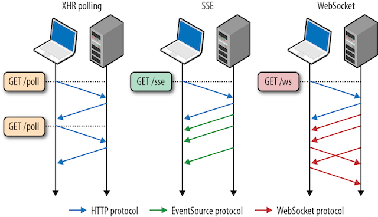

Socket.IO, based on its name, seems like it deals with WebSockets. I
know a bit about WebSockets, but other than that Socket.IO seems
mysterious. Let's investigate.

What are WebSockets?
--------------------

First of all, we need to know a bit about WebSockets before Socket.IO
will make sense.

WebSockets are in the realm of HTTP or AJAX. They are a method for two
computers to talk to each other. In the common case where you have
your web browser talk to your server, the browser had to initiate all
the requests and the server could merely respond. WebSockets allow
for both sides to send messages back and forth.

Ignore the SSE portion of the below graphic.  XHR is like your AJAX
(XmlHttpRequest). Note the difference between AJAX and WebSocket. In
AJAX all interaction need to be initiated by the client. In the
WebSocket example, the server is able to send messages at its leisure.

Q: We're going to be coding a chat application later. Why might it be
easier with WebSockets than it would be with the normal HTTP
request/response model?

What is Socket.IO?
------------------

We start on the [Socket.IO website](http://socket.io/). The home page
shows code snippets in JavaScript and Node.js. Now I can rule out
other things, like it being a Ruby framework or a Python library. The
demos aren't very helpful in determining if it's server-side,
client-side, or both. I'm also not sure how it's different from raw
WebSockets. "Getting Started" looks like it will walk me through some
tutorials, but I'm not ready for that level of committment. The
[docs](http://socket.io/docs/) help narrow the scope since I see `npm`
and `Express` mentioned, which tie into things I know.  I also see
notes about both a "Server API" and a "Client API", so I guess it's
both a client-side and server-side solution.

I found the [Wikipedia entry](http://en.wikipedia.org/wiki/Socket.IO)
to be very helpful in getting a high-level overview. It clarifies:

- it's a JavaScript library
- enables bi-directional communication between client and server
- is a server-side and client-side library
- uses WebSockets (with a fallback if WebSockets is unsupported)
- adds some additional features on top of WebSockets

Time to try it out
------------------

You never really understand something until you try it.

I'm going to work through both tutorials listed on Socket.IO's
[Get Started](http://socket.io/get-started/) page.

1. Start with the
   [Chat application](http://socket.io/get-started/chat/).

2. Welp, the second tutorial says "Coming soon!". Interesting. I won't
   soon forget this betrayal of trust, Socket.IO.

Chat application
----------------

### Steps

1. Work through ["The web framework"](http://socket.io/get-started/chat/) section.
2. Try it out. Tinker with parts you don't understand.
3. Work through the "Serving HTML" section.
4. See (2)
5. "Integrating Socket.IO".
6. See (2)
7. "Emitting events".
8. See (2)
9. "Broadcasting".
10. See (2)
11. Your homework is their "Homework". This is optional.

### Notes

- Can I set up my Express server like I'm used to or do I have to
  follow the Socket.IO tutorial exactly?

    - Generally good to try your own code to see if things work the
      way you think they do.

- `res.sendFile(__dirname + '/index.html');` works but later on they
  show `res.sendfile('index.html');`.

    - This is fixed in a yet unmerged pull request.

- `<script src="/socket.io/socket.io.js">` changed to `<script
  src="https://cdn.socket.io/socket.io-1.2.0.js">`

- `return false` instead of `event.preventDefault()`?

Resources
---------

[StackOverflow on Polling vs. WebSockets](http://stackoverflow.com/questions/11077857/what-are-long-polling-websockets-server-sent-events-sse-and-comet)

